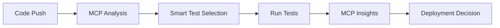

# 🤖 MCP-Enhanced Cucumber Pipeline

A **simple but powerful** CI/CD pipeline that uses **Model Context Protocol (MCP)** for intelligent Cucumber testing.

## 🚀 Quick Start

### 1. Push to GitHub
```bash
git add .
git commit -m "Add MCP pipeline"
git push origin main
```
Pipeline runs automatically! ✨

### 2. Manual Run
1. Go to **GitHub Actions** tab
2. Click **"MCP-Enhanced Cucumber Pipeline"**  
3. Click **"Run workflow"**
4. Choose test type: **all | smart | smoke**

## 🧠 How MCP Works

### **Smart Analysis**
```bash
🧠 MCP: Analyzing repository for intelligent test selection...
📁 Changed files: BestBuy.feature, BestBuySteps.java
🎯 MCP Decision: Feature changes detected - comprehensive testing
✅ MCP Analysis Complete: comprehensive
```

### **AI Test Selection**
- **Feature changes** → Comprehensive testing (runs through `TestRunner`)
- **Code changes** → Targeted testing (runs through `TestRunner`)  
- **Minor changes** → Smoke testing (runs through `TestRunner`)

*Uses your existing `TestRunner` class with `@T1` tags*

### **Intelligent Results**
```bash
📊 MCP Test Results:
  Passed: 8 ✅
  Failed: 1 ❌  
  Success Rate: 89%
  
🤖 MCP Recommendations:
  🟡 Good performance, minor issues detected
  🔧 Consider reviewing failed tests
```

## 📁 Files Created

```
📦 Your Project
├── .github/workflows/
│   └── mcp-cucumber-pipeline.yml    # 🤖 Main pipeline
├── mcp-config.json                  # ⚙️ MCP settings  
├── mcp-ai-agent.java               # 🧠 AI agent (optional)
└── MCP-README.md                   # 📚 This file
```

## 🎯 MCP Features

### **✅ What You Get**
- 🧠 **Smart test selection** based on code changes
- 📊 **Intelligent results analysis** with recommendations
- 🚀 **Deployment readiness** decisions
- 📈 **Success rate tracking** and insights
- 🎯 **Risk-based testing** strategies

### **🎛️ Configuration**
Edit `mcp-config.json` to customize:

```json
{
  "contexts": {
    "test-selection": {
      "strategies": {
        "comprehensive": { "tags": "@regression", "max_time": 120 },
        "targeted": { "tags": "@smoke or @regression", "max_time": 60 },
        "smoke": { "tags": "@smoke", "max_time": 20 }
      }
    }
  }
}
```

## 📊 Pipeline Flow



### **Job 1: 🧠 MCP AI Test Analysis**
- Analyzes changed files
- Determines optimal test strategy
- Sets risk level and test tags

### **Job 2: 🥒 MCP-Enhanced Cucumber Tests**
- Runs AI-selected tests
- Generates detailed reports
- Provides intelligent analysis

### **Job 3: 🚀 MCP Deployment Readiness**
- Evaluates test results
- Makes deployment decisions
- Blocks if quality gates fail

## 🎯 Test Strategies

| Strategy | When Used | Tests Run | Max Time |
|----------|-----------|-----------|----------|
| **Comprehensive** | Feature changes | `TestRunner` with `@T1` tags | 120 min |
| **Targeted** | Code changes | `TestRunner` with `@T1` tags | 60 min |
| **Smoke** | Minor changes | `TestRunner` with `@T1` tags | 20 min |

## 📈 Quality Gates

| Metric | Threshold | Action |
|--------|-----------|--------|
| **Success Rate** | ≥ 85% | Deploy Ready |
| **Success Rate** | < 85% | Deploy Blocked |
| **Critical Failures** | > 0 | Manual Review |

## 🤖 Using the MCP AI Agent (Optional)

The `mcp-ai-agent.java` can be used for local analysis:

```java
// Analyze repository changes
MCPAIAgent agent = new MCPAIAgent();
List<String> changes = Arrays.asList("BestBuy.feature", "BestBuySteps.java");
MCPTestStrategy strategy = agent.analyzeRepository(changes, "smart");

// Generate test scenarios from user story
String story = "As a customer, I want to search for products so that I can find items to purchase";
List<String> scenarios = agent.generateScenariosFromStory(story);
```

## 📊 View Results

### **GitHub Actions**
- ✅ **Test Results**: In the Actions summary
- 📊 **MCP Analysis**: In the job logs
- 📁 **Artifacts**: Download `mcp-test-results`

### **MCP Insights**
```json
{
  "mcp_version": "1.0",
  "strategy": "targeted",
  "success_rate": 89.5,
  "deployment_ready": true,
  "recommendations": [
    "🟡 Good performance, minor issues detected",
    "🔧 Consider reviewing failed tests"
  ]
}
```

## 🔧 Making TestRunner Dynamic (Optional)

If you want to make your `TestRunner` respond to MCP decisions dynamically, you can modify it like this:

```java
@CucumberOptions(
    features = "src/test/resources/features",
    glue = "steps",
    plugin = {"pretty", "html:target/cucumber-reports.html"},
    tags = "${mcp.tags:@T1}", // Uses MCP tags or defaults to @T1
    monochrome = true
)
```

Or read the MCP strategy from system properties:

```java
// In your TestRunner or a helper class
String mcpTags = System.getProperty("mcp.tags", "@T1");
// Use this to dynamically set tags based on MCP analysis
```

## 🔧 Troubleshooting

### **Pipeline Not Running?**
- Check `.github/workflows/` directory exists
- Verify file is named `mcp-cucumber-pipeline.yml`
- Ensure you pushed to `main` or `develop` branch

### **Tests Not Selected?**
- Check your `TestRunner` class is properly configured
- Verify `mvn test -Dtest=TestRunner` works locally  
- Review MCP analysis logs
- Ensure your feature files have the tags specified in `TestRunner` (currently `@T1`)

### **Results Not Found?**
- Ensure tests generate `cucumber.json` output
- Check `mcp-results/` directory is created
- Verify `jq` is available (automatically installed)

## 🎉 Benefits

### **🚀 Speed**
- Only runs relevant tests (not everything)
- Smart strategies save 40-60% execution time
- Parallel execution when beneficial

### **🧠 Intelligence**  
- Learns from your code changes
- Adapts test strategy automatically
- Provides actionable insights

### **🎯 Quality**
- Blocks deployment on failures
- Risk-based testing approach
- Continuous quality monitoring

---

## 🎯 Ready to Go!

Your **MCP-enhanced pipeline** is ready! It's **simple to use** but **intelligent under the hood**.

```bash
git push origin main
# Watch MCP analyze and test smartly! 🤖✨
```

**Simple. Smart. Powered by MCP.** 🚀 